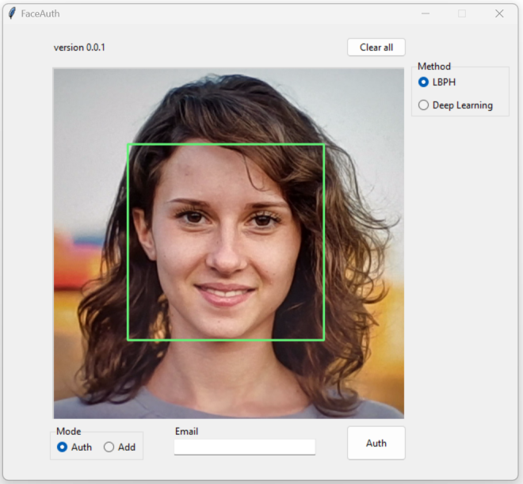

# FaceAuth

Desktop video-based face verification demo built with Python, Tkinter, OpenCV, and `face_recognition`.

> ⚠️ This application was created for educational and research purposes. It demonstrates local face verification in a desktop environment and can be used to compare classical and deep learning-based face recognition approaches.

## Overview

`FaceAuth` is a small desktop application that implements a simple face verification step based on a webcam video stream. The project was built as an educational prototype showing how biometric verification can be added to a user flow and how different face recognition methods behave in practice.

The application includes two switchable recognition methods:

- `LBPH`, a classical feature-based approach;
- `Deep Learning`, an embedding-based approach using `face_recognition`.

The app lets you:

- register a user by email and face sample from a webcam;
- store face descriptors in a local SQLite database;
- verify whether the person in front of the camera matches the face data stored for a specific email;
- switch between two matching approaches: `LBPH` and `Deep Learning`.

The application uses a live camera stream, detects the face in the frame, extracts descriptors, and compares them with descriptors previously saved for the selected user. When a user is updated, new feature vectors are appended to the existing user profile, which helps capture different lighting conditions and facial expressions.

## Limitations

This project focuses on simple `1:1` face verification and is intended for educational use. It does not implement `liveness detection` or face `anti-spoofing` protection.

## Stack

- Python 3.10
- Tkinter + Pygubu
- OpenCV + `face_recognition`
- SQLAlchemy + Alembic
- SQLite

## Prerequisites

- Python 3.10
- Webcam access

Linux:

```bash
sudo apt-get install build-essential
```

Windows:

`face_recognition` can be difficult to install depending on your environment. This thread may help:

https://github.com/ageitgey/face_recognition/issues/175#issue-257710508

## Getting Started

### 1. Install dependencies

```bash
pip install -r requirements.txt
```

### 2. Run database migrations

From the repository root:

```bash
alembic upgrade head
```

This creates the local SQLite database used by the app at `app/files/db`.

### 3. Start the application

Run the GUI from the `app` directory:

```bash
cd app
python main.py
```

## Screenshots

### Add User

In `Add` mode, the application captures the current face from the webcam and saves or updates descriptors for the entered email.


### Authentication

In `Auth` mode, the application performs face verification: it checks whether the current face matches the descriptors stored for the entered email using the selected recognition method.


### GUI



GUI demo photo: Photo by [Irene Strong](https://unsplash.com/photos/women-smiling-close-up-photography--FOUPtqP-mY) on [Unsplash](https://unsplash.com/license).
